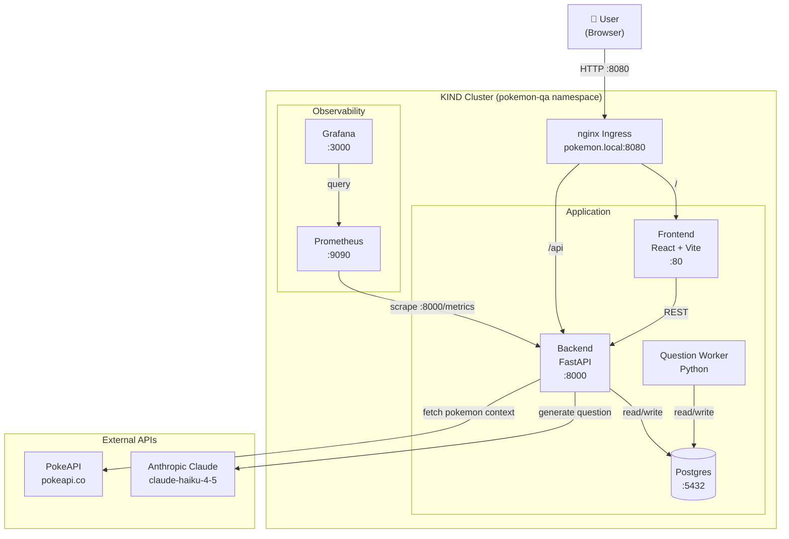

# Pokemon Q&A App

Production-like conference demo app running on KIND:

- Backend: FastAPI + Anthropic Claude API + PokeAPI context
- Frontend: React + Vite + TypeScript
- Data: Postgres for session/question history
- Worker: separate Python process for async/background jobs
- Observability: Prometheus + Grafana baseline

## Architecture



## Quickstart

1. Create a local Anthropic key secret for Kubernetes:

```bash
cp infra/k8s/base/secret.example.yaml infra/k8s/base/secret.yaml
# edit ANTHROPIC_API_KEY in infra/k8s/base/secret.yaml
```

2. Start KIND and ingress:

```bash
make kind-up
```

3. Build and load images into KIND:

```bash
make build-images
make load-images
```

4. Deploy app:

```bash
kubectl apply -k infra/k8s/base
kubectl apply -f infra/observability/observability-prometheus-k8s.yaml
kubectl apply -f infra/observability/grafana.yaml
```

5. Add local host mapping:

```bash
echo "127.0.0.1 pokemon.local" | sudo tee -a /etc/hosts
```

6. Open app:

- http://pokemon.local:8080

## Local dev (without cluster)

### 1) Start local Postgres (required)

If Postgres is installed via Homebrew:

```bash
brew services start postgresql@16 || brew services start postgresql
```

Create app database:

```bash
createdb pokemon_qa || true
```

Backend:

```bash
cd backend
python -m venv .venv
source .venv/bin/activate
pip install -r requirements.txt
uvicorn app.main:app --reload
```

Health check:

```bash
curl http://localhost:8000/healthz
```

Frontend:

```bash
cd frontend
npm install
npm run dev
```

Open:

- http://localhost:5173

The frontend proxies `/api/*` to `http://localhost:8000` in local dev.

## Current status

This is v0 scaffold with core API flow and deployment assets. Next implementation pass should add:

- Alembic migrations instead of metadata auto-create
- Worker queue + real async generation job table
- JWT + rate limiting
- OpenTelemetry exporters and Grafana dashboards
- CI pipeline and tests
